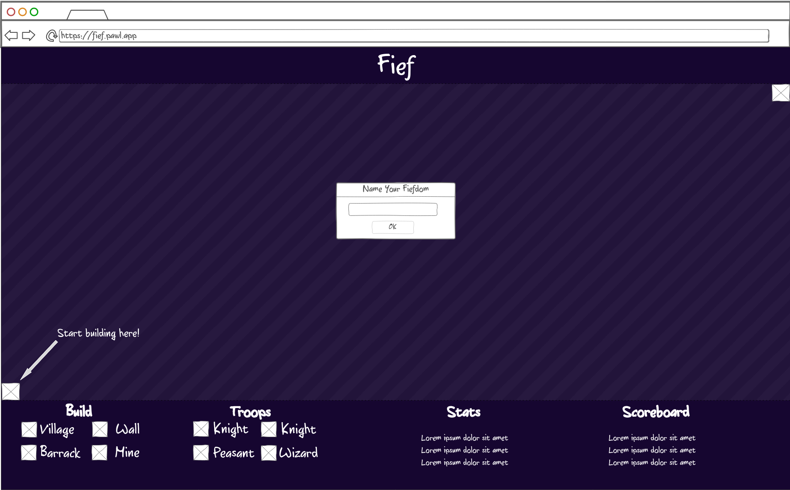

# Fief
A ~~mediocre~~ revolutionary, ~~unoriginal~~ first of its kind, ~~meh~~ knock your trousers off tile game. 

## What's a Fief?
Are you tired of combing through dozens of .io games? Then Fief --notably _not_ hosted on a .io domain-- is for you! Fief is a tile game where you can build your own kingdom, and conquer your friends' kingdoms. Pick your colors, then start building! Your enemies will be playing at the same time, so be sure to keep an eye on their progress. Players can build villages and barracks to increase their power, and can build walls to protect their kingdom. Use your troops to attack enemy units and buildings. A player loses once their castle is destroyed. The last player standing wins!

## Key Features
* **Multiplayer** - Play with your friends in real time
* **Mobile Friendly** - Works on any device with a browser!
* **Restricted View** - Only see tiles close to your structures
* **Buildings** - Build villages and barracks to increase your power
* **Persistent Scoreboard** - Compete with your friends to and track who has the most wins

# Concept Mockup

